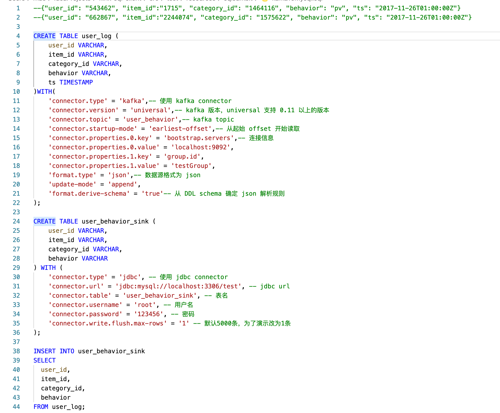
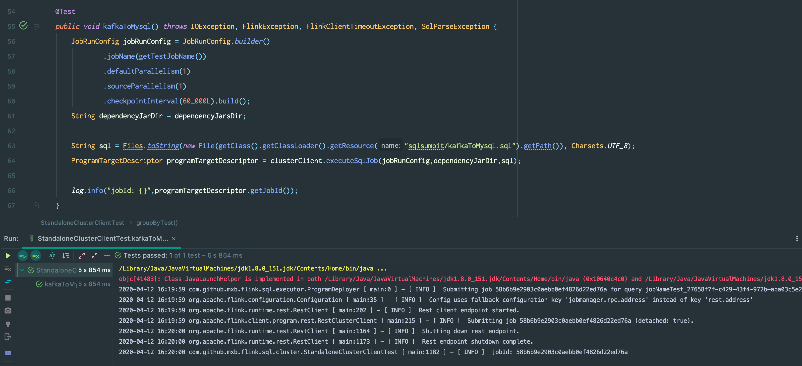
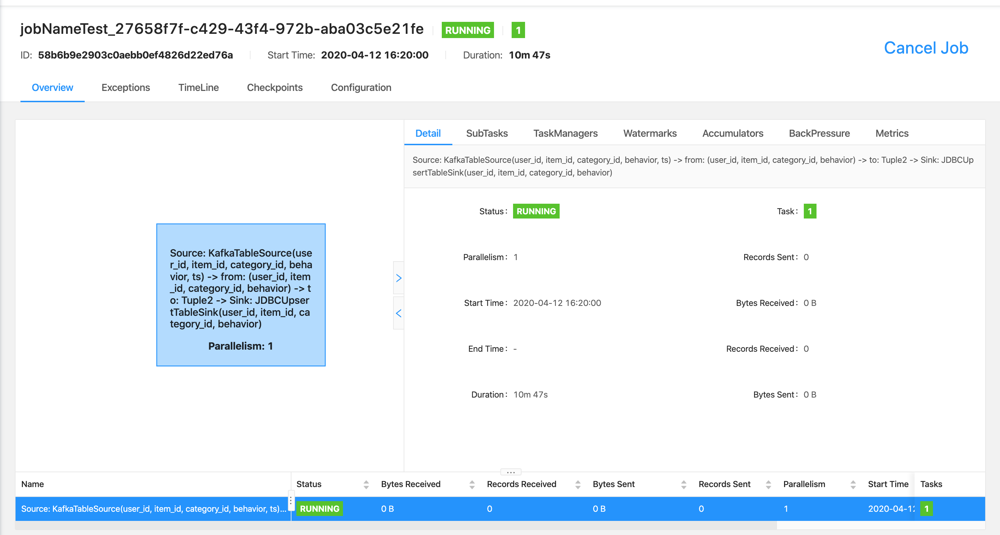

# flink sql client

基于flink-1.9.1,支持flink在不同集群模式下的sql任务提交，区别于flink官方提供的sql client模块,官方提供的是需要单独执行的服务，这里提供的是一个sdk,可以无缝接入自己的流计算平台.

## 功能支持

功能 | flink sql client sdk | flink sql client
:--:|:--:|:--:|
SQL任务提交 | 支持standalone集群, flink on yarn session集群的远程SQL任务提交,不同job提交线程隔离 | 支持standalone集群任务提交,需要启动单独进程
任务操作 | 支持standalone集群, flink on yarn session集群的远程任务面向jobId进行stop(WithOrWithoutSavepoint),cancel(WithOrWithoutSavepoint),triggerSavepoint | 不支持
任务执行状态查询 | 支持standalone集群, flink on yarn session集群的远程任务运行状态查询 | 不支持
多Insert into任务支持 | 支持多Insert into语句的多Sink SQL任务 | 支持
UDF包动态加载 | 支持SQL job动态加载UDF包,每一个SQL job可以在画图时指定特定的UDF包 | 不支持
Connector包动态加载 | 支持SQL job动态加载Connector包,每一个SQL job可以在画图时指定特定的Connector包 | 不支持

## quick start

### standalone模式

* 启动flink standalone集群,rest端口为8081
* 运行com.github.mxb.flink.sql.cluster.StandaloneClusterTest中的kafkaToMysqlTest测试用例

#### Test用例

* com.github.mxb.flink.sql.cluster.StandaloneClusterTest.kafkaToMysqlTest测试用例
  * 完整SQL

  * 执行StandaloneClusterTest中的kafkaToMysqlTest测试用例

  * flink-standalone集群job信息


### flink on yarn模式

* 启动flink on yarn集群,获得applicationId
* 运行com.github.mxb.flink.sql.cluster.YarnClusterClientTest中的kafkaToMysqlTest测试用例

### 本地Minicluster模式

* 运行com.github.mxb.flink.sql.local.LocalClusterClientTest里面的测试用例(可用于本地调试分布式任务)

## sdk quick start

* 项目引入flink-sql-client

```maven
<dependency>
    <groupId>com.github.mxb</groupId>
    <artifactId>flink-sql-client</artifactId>
    <version>1.0-SNAPSHOT</version>
</dependency>
```

* 实例化取出clusterClient并执行SQL job

```java
public class Test{
    public ClusterClient getClusterClient(){
        FlinkResourceInfo standaloneResourceInfo = new FlinkResourceInfo();
        standaloneResourceInfo.setResourceType(ResourceType.STANDALONE);

        ClusterDescriptor clusterDescriptor = ClusterDescriptorFactory.createClusterDescriptor(standaloneResourceInfo);
        StandAloneClusterId standAloneClusterId = new StandAloneClusterId("127.0.0.1", 8081);
        ClusterClient clusterClient = clusterDescriptor.retrieve(standAloneClusterId);
    }

    public String executeSqlJob(String sql, List<File> dependencyJars){
        ClusterClient clusterClient = getClusterClient();
        JobRunConfig jobRunConfig = JobRunConfig.builder()
                        .jobName(getTestJobName())
                        .defaultParallelism(1)
                        .sourceParallelism(1)
                        .checkpointInterval(60_000L).build();
        ProgramTargetDescriptor programTargetDescriptor = clusterClient.executeSqlJob(jobRunConfig, dependencyJars, sql);
        return programTargetDescriptor.getJobId();
    }
}
```

## 问题处理

* 执行groupByTest用例时会出现InvalidClassException异常，local class incompatible serialVersionUID;解决:在flink-parent中修改对应的类并重新引入

```scala
@SerialVersionUID(value = 1)
abstract class ProcessFunctionWithCleanupState
```
